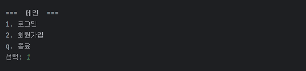
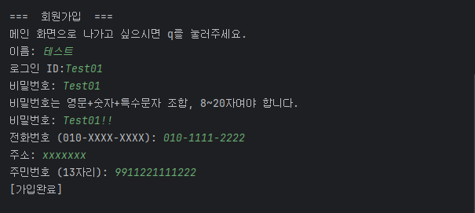
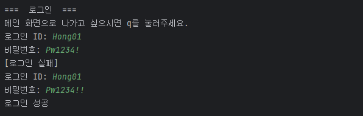
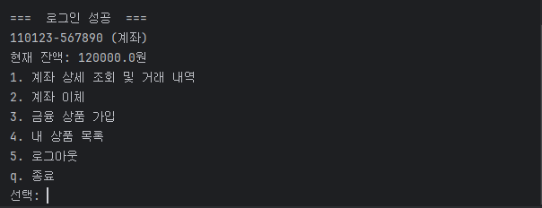
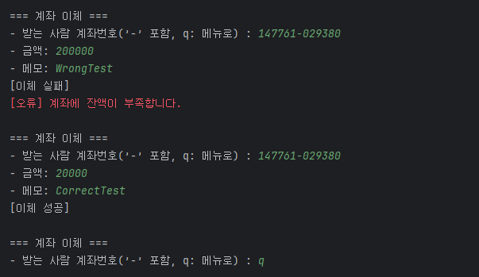
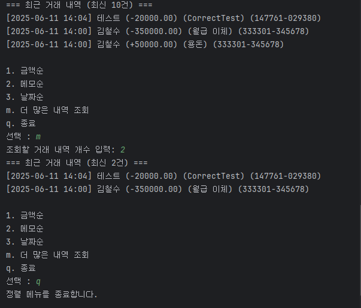
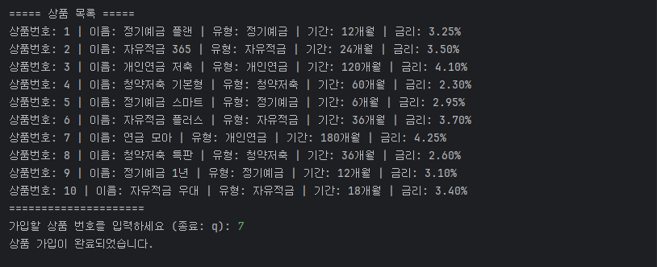
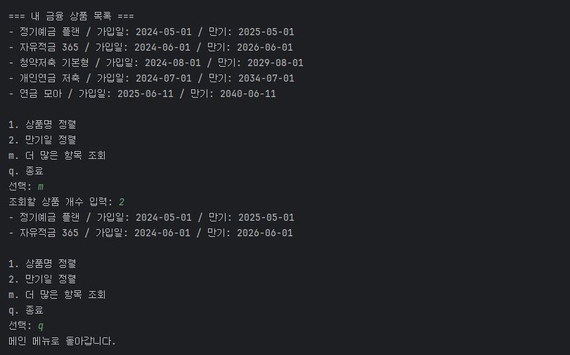

# 💰 KB 이체 및 금융상품 가입 시스템

> KB IT’s Your Life 6기 교육 과정 중 진행한 DB, JDBC를 활용한 팀 프로젝트입니다.
로그인 기능을 포함한 **이체 서비스**와 **금융상품 가입 기능**을 구현한 은행 시스템입니다.
--- 

- **주제**: 은행 이체 서비스 및 상품 가입 서비스 구현
- **기간**: 2025.05.12 ~ 2025.06.11
- **참여 인원**: 5명 (고두환, 김은수, 양민영, 이건우, 이수현)
- **목표**: MySQL, JDBC를 활용한 은행 시스템 구현 및 데이터 흐름 학습

---

## 👥 팀원 소개 & 역할

| 이름     | 역할                                                                                                                                                                                                                                                                                                                                   | GitHub ID       |
|----------|--------------------------------------------------------------------------------------------------------------------------------------------------------------------------------------------------------------------------------------------------------------------------------------------------------------------------------------|-----------------|
| 고두환   | • 거래 VO 및 DAO 구현 (TransactionVO, TransactionDao, TransactionDaoImpl)<br>• 거래 서비스 계층 구현 (TransactionService)<br>• 거래 실행부 구현 (TransactionApp)<br>• DB 테이블 정의 (TransactionTable)                                                                                                                                                        | [GitHub](https://github.com/story125)   |
| 김은수   | • 상품 VO 및 DAO 구현 (ProductVO, ProductDao, ProductDaoImpl)<br>• 거래 내역 조회 서비스 (TransactionListService, TransactionListServiceImpl)<br>• 거래 조회 실행부 (TransactionHistoryApp)<br>• DB 테이블 정의 (ProductTable)                                                                                                                                 | [GitHub](https://github.com/ensookim)   |
| 양민영   | • 계좌 VO 및 DAO 구현 (AccountVO, AccountDao, AccountDaoImpl)<br>• 상품 목록 조회 서비스 구현 (ProductListService, ProductListServiceImpl)<br>• 메인, 상품 리스트 실행부 구현 (MainApp, ProductListApp)<br>• DB 테이블 정의 (AccountTable)<br>• Notion 문서화 / ReadMe 문서 작성<br>• GitHub 배포 준비 (application.properties 관리, .gitignore 설정, MainLauncher 구성, Gradle 빌드 설정) | [GitHub](https://github.com/Minyoung06)   |
| 이건우   | • 유저 상품 VO 및 DAO 구현 (UserProductVO, UserProductDao, UserProductDaoImpl)<br>• 상품 가입 서비스 (ProductJoinService, ProductJoinServiceImpl)<br>• 상품 가입 실행부 (ProductJoinApp)<br>• DB 테이블 정의 (UserProductTable)                                                                                                                                | [GitHub](https://github.com/Kyun17)   |
| 이수현   | • 유저 VO 및 DAO 구현 (UserVO, UserDao, UserDaoImpl)<br> • 유저 서비스 계층 구현 (UserService, UserServiceImpl)<br>• 세션 관리 (Session)<br>• 메인 실행 (MainApp)<br>• 유틸리티 클래스 (AccountUtil, ValidatorUtil)<br>• DB 테이블 정의 (UserTable)                                                                                                                    | [GitHub](https://github.com/soohyun1904)   |

---

## 🛠 기술 스택

### Programming & Database


### Build & Dependency


### IDE & Tools


### Version Control & Docs


---

## 시작 가이드

### ✅ 1. 실행 전 준비

- Java 17 이상 설치 필요
- MySQL 서버 실행 중이어야 하며, `application.properties` 설정과 DB 상태가 일치해야 합니다.

> `src/main/resources/application.properties.template`를 복사하여  
> `application.properties`로 이름을 바꾸고, 본인 환경에 맞게 설정하세요:
>
> ```properties
> driver=com.mysql.cj.jdbc.Driver
> url=jdbc:mysql://127.0.0.1:3306/DBank
> id=your_db_id
> password=your_db_password
> ```

> ⚠️ `application.properties`는 보안상 `.gitignore`에 포함되어 있어 GitHub에 업로드되지 않습니다.

#### 📌 추가 체크리스트

- [ ] **DB 및 테이블 구성 완료 여부**  
  MySQL에 `DBank` 데이터베이스와 관련 테이블(user, account 등)이 생성되어 있어야 합니다.

- [ ] **DB 계정 권한 확인**  
  `application.properties`에 명시한 DB 계정은 `SELECT`, `INSERT`, `UPDATE`, `DELETE` 권한이 있어야 합니다.

- [ ] **MySQL 포트 확인 (기본: 3306)**  
  다른 프로세스가 포트를 점유 중이면 연결 오류 발생 가능성이 있습니다.

- [ ] **UTF-8 인코딩 설정 확인**
    - 모든 `.java` 파일, `.properties` 파일이 UTF-8로 인코딩되어야 합니다.
    - IntelliJ 기준: `File > File Encoding > UTF-8`

- [ ] **방화벽 또는 보안 프로그램 예외 설정 (Windows)**  
  MySQL 접근이 차단되지 않도록 방화벽, 백신 등의 설정을 확인하세요.

> 보안을 위해 `application.properties`는 `.gitignore`에 포함시키는 것을 권장합니다.

### ✅ 2. 프로젝트 다운로드 및 빌드

```bash
# 프로젝트 클론
git clone https://github.com/Minyoung06/DBank-Project.git
cd DBank-Project

# fat JAR 생성
./gradlew shadowJar
```

> 빌드가 완료되면 실행 파일은 `build/libs/DBank-Project-1.0-SNAPSHOT-all.jar` 경로에 생성됩니다.

### ✅ 3. 실행 방법

#### Windows (PowerShell)
```bash
java --% -Dfile.encoding=UTF-8 -jar build/libs/DBank-Project-1.0-SNAPSHOT-all.jar
```
#### macOS / Linux / Git Bash
```bash
java -Dfile.encoding=UTF-8 -jar build/libs/DBank-Project-1.0-SNAPSHOT-all.jar
```

> ⚠️ 실행 시 한글이 깨질 경우 -Dfile.encoding=UTF-8 옵션이 포함되어 있는지 확인하세요.
---

## 🖼️ 화면 구성 요약

| 화면 항목       | 설명                 | 캡처 이미지 |
|-------------|--------------------|--------------|
| 로그인/회원가입 메뉴 | 로그인/회원가입/종료 선택     |  |
| 회원가입        | 비밀번호 조건 실패 → 재입력   |  |
| 로그인 성공/실패   | 실패 메시지 → 재시도       |  |
| 메인 메뉴       | 계좌번호, 잔액, 메뉴 출력    |  |
| 이체 시도       | 계좌 이체 잔액 부족 -> 재시도 |  |
| 거래내역 조회     | 정렬 및 출력건수 설정       |  |
| 금융상품 가입     | 상품 선택 및 가입 완료      |  |
| 상품 목록 보기    | 정렬 및 개수 설정 기능      |  |

---

## 🗂️ 폴더 구조
```
DBank-Project/
├── src/
│ ├── main/
│ │ ├── java/
│ │ │ ├── app/ # 메인 실행 클래스들 (MainApp 등)
│ │ │ ├── common/ # 공통 유틸 및 세션 객체
│ │ │ ├── dao/ # DAO 인터페이스 및 구현체
│ │ │ ├── database/ # DB 연결 유틸 (JDBCUtil)
│ │ │ ├── domain/ # VO(Value Object) 클래스들
│ │ │ ├── service/
│ │ │ │ ├── product/ # 상품 가입 서비스
│ │ │ │ ├── productList/ # 상품 목록 조회 서비스
│ │ │ │ ├── transaction/ # 거래 처리 서비스
│ │ │ │ ├── transactionList/ # 거래 내역 조회 서비스
│ │ │ │ └── user/ # 사용자 관련 서비스
│ │ │ └── util/ # 유틸리티 클래스 (AccountUtil, ValidatorUtil)
│ │ └── resources/ # 설정 파일 (application.properties)
│ └── test/
│     ├── java/
│     │   ├── app/ # 메인 앱 테스트
│     │   └── manualTest/ # DAO 수동 테스트
│     └── resources/ # 테스트용 리소스
│
├── build/ # 빌드 결과물 (컴파일된 클래스 등)
├── docs/ # 문서 및 ERD 이미지
├── gradle/ # Gradle Wrapper 설정
└── build.gradle / settings.gradle # Gradle 설정 파일
```
---

## 🗃️ 데이터베이스 구조

> 👉 [DB 구조 자세히 보기](./docs/database.md)

---

## 🔗 관련 링크

- **Notion 프로젝트 소개 페이지**: [DB 프로젝트 - 은행 서비스](https://jazzy-newt-fce.notion.site/DB-1f371cb1a07180428f2ff1c4655ef679)


