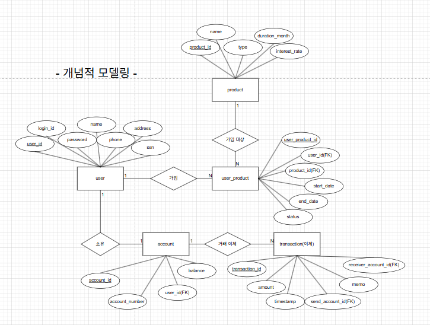
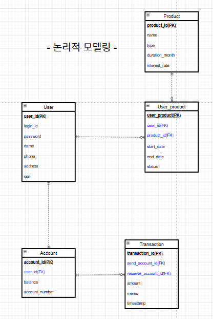
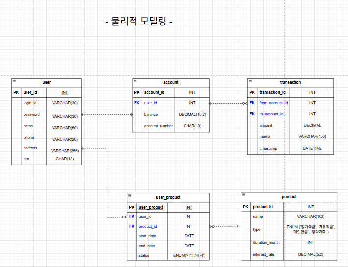

## DB 설계

### 📌 개요

이 프로젝트는 사용자, 계좌, 금융상품, 거래, 가입상품 간의 관계를 기반으로 동작하는 금융 시스템입니다.  
총 5개의 주요 테이블로 구성되어 있으며, 실생활의 은행 서비스 흐름을 반영하여 설계되었습니다.

- **User ↔ Account**: 1:N (사용자는 하나 이상의 계좌 보유 가능)
- **User ↔ Product**: N:M (`user_product` 테이블로 가입 내역 관리)
- **Account ↔ Transaction**: 1:N (송신/수신 계좌 기준으로 거래 기록)

---

### 📷 ERD 이미지

| 개념적 모델링 (Conceptual) | 논리적 모델링 (Logical)                 | 물리적 모델링 (Physical)                  |
|-----------------------------|-----------------------------------|-------------------------------------|
|  |  |  |

---

### 📋 테이블 요약

#### 👤 `user`

| 컬럼명   | 타입       | 설명              |
|----------|------------|-------------------|
| user_id  | INT (PK)   | 사용자 고유 ID     |
| login_id | VARCHAR(30)| 로그인 ID (고유)   |
| password | VARCHAR(30)| 비밀번호           |
| name     | VARCHAR(50)| 이름               |
| phone    | VARCHAR(20)| 전화번호           |
| address  | VARCHAR(255)| 주소              |
| ssn      | CHAR(13)   | 주민등록번호 (고유) |

---

#### 🏦 `account`

| 컬럼명        | 타입       | 설명             |
|----------------|------------|------------------|
| account_id     | INT (PK)   | 계좌 ID          |
| user_id        | INT (FK)   | 소유 사용자 ID   |
| balance        | DECIMAL    | 잔액             |
| account_number | CHAR(13)   | 계좌번호 (고유)  |

---

#### 💰 `product`

| 컬럼명         | 타입       | 설명              |
|----------------|------------|-------------------|
| product_id     | INT (PK)   | 상품 ID           |
| name           | VARCHAR(100)| 상품명 (고유)     |
| type           | ENUM       | 상품 유형         |
| duration_month | INT        | 유지 기간 (개월)  |
| interest_rate  | DECIMAL    | 이율 (%)          |

---

#### 📄 `user_product`

| 컬럼명         | 타입     | 설명                  |
|----------------|----------|------------------------|
| user_product_id| INT (PK) | 가입 상품 고유 ID      |
| user_id        | INT (FK) | 사용자 ID             |
| product_id     | INT (FK) | 금융상품 ID           |
| start_date     | DATE     | 가입일                |
| end_date       | DATE     | 만기일                |
| status         | ENUM     | 가입 상태 (가입/해지)  |

---

#### 🔁 `transaction`

| 컬럼명             | 타입       | 설명                 |
|--------------------|------------|----------------------|
| transaction_id     | INT (PK)   | 거래 ID              |
| send_account_id    | INT (FK)   | 송신 계좌 ID         |
| receiver_account_id| INT (FK)   | 수신 계좌 ID         |
| amount             | DECIMAL    | 이체 금액            |
| memo               | VARCHAR(100)| 메모 (선택)          |
| timestamp          | DATETIME   | 거래 시간 (기본 NOW) |

---

### 🔒 제약조건 및 설계 특징

- 외래키 제약 조건은 참조 무결성을 보장하며 일부는 `ON DELETE CASCADE` 설정
- 계좌번호(`account_number`), 주민등록번호(`ssn`), 로그인 ID(`login_id`)는 고유 제약 조건 적용
- 사용자와 금융상품은 `user_product`를 통해 다대다 관계 형성
- 거래 기록은 변경/삭제 없이 누적되며, 금융 흐름 이력을 보존함

---

### 💾 SQL 스키마 및 예제 데이터

📄 [`DBase.sql`](../DBase.sql)

- `CREATE TABLE` 문을 통한 전체 테이블 정의
- 제약 조건 및 ENUM 타입 구성
- 사용자 / 계좌 / 상품 / 가입 / 거래 예제 데이터 삽입 포함

> 👉 이 파일을 MySQL에서 실행하면 데이터베이스 초기화 및 테스트 데이터 구성이 자동으로 완료됩니다.
